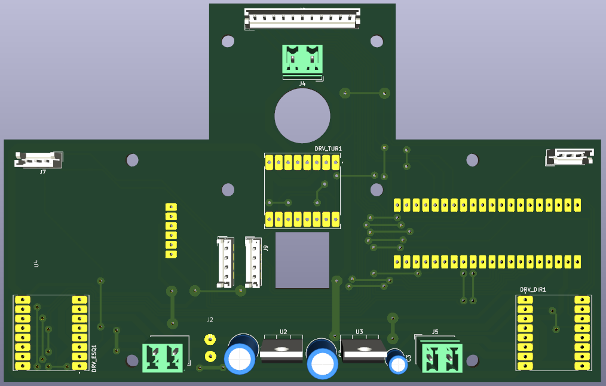
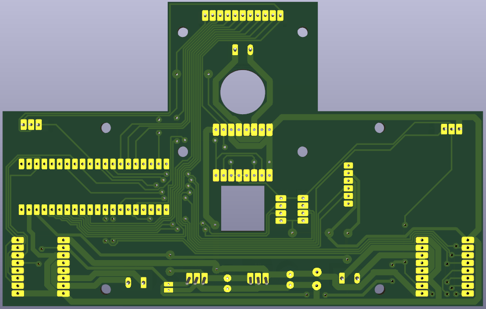
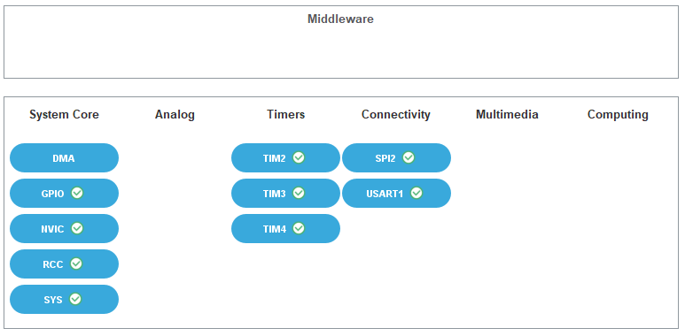
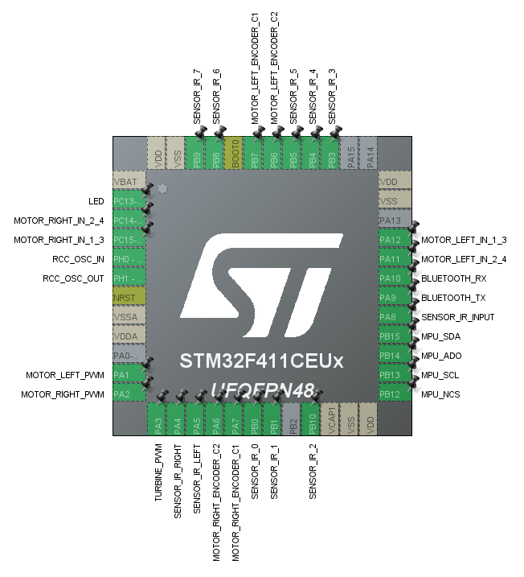
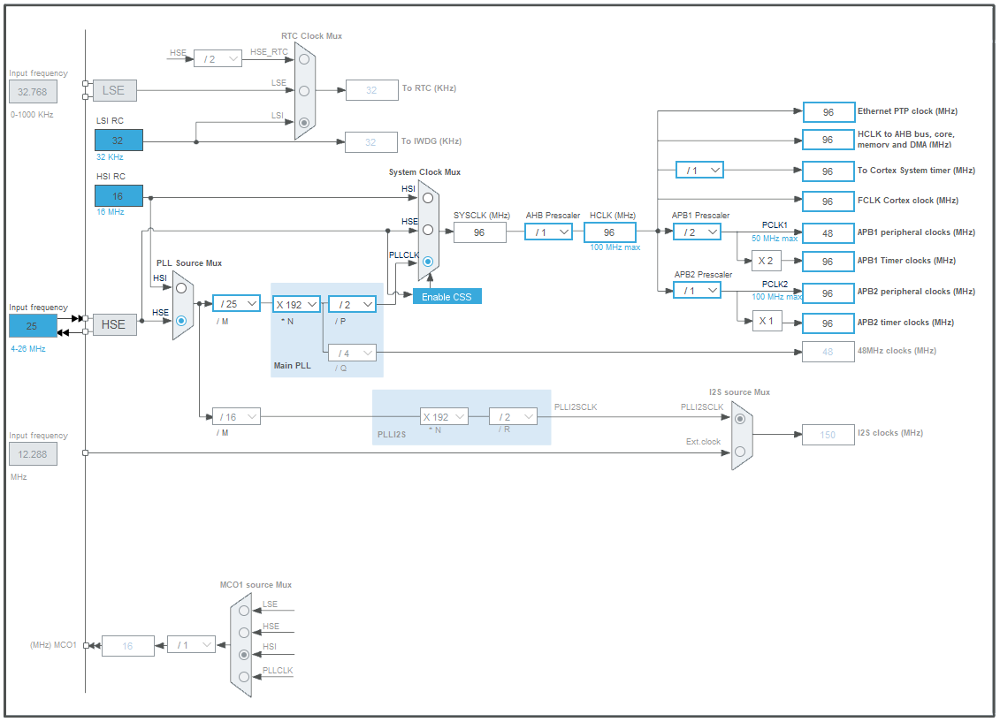
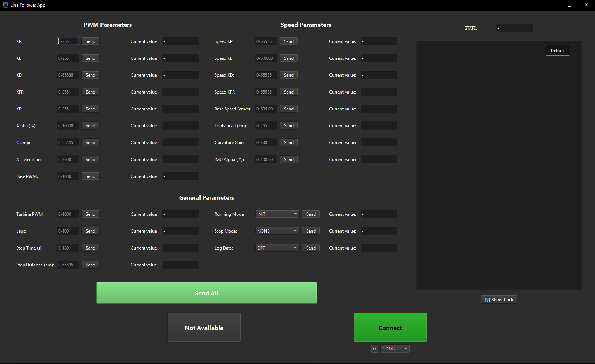
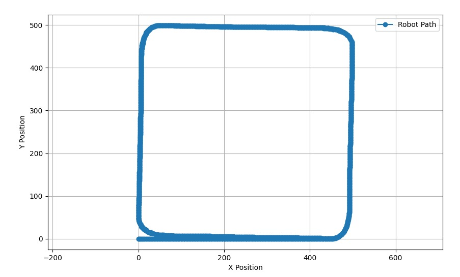
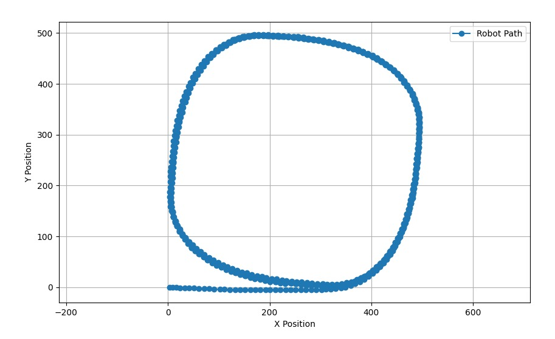

# Line Follower Robot STM32

This project implements a line-follower robot using an STM32 microcontroller, `IR` sensors for vision, encoders and an `MPU9050` for navigation. The project is written entirely in C using the STM32 LL (Low-Layer) library for direct hardware access and control.

<div align="center">
  
</div>

## Contents

- [Features](#features)
- [Hardware Setup](#hardware-setup)
  - [3D Printed Base](#3d-printed-base)
    - [Sensors](#sensors)
    - [Wheels and Motors](#wheels-and-motors)
    - [Turbine and Skirt](#turbine-and-skirt)
  - [Printed Circuit Board (PCB)](#printed-circuit-board-pcb)
    - [Power Supply](#power-supply)
- [Software Setup](#software-setup)
  - [Toolchain Installation](#toolchain-installation)
  - [Peripheral Configuration](#peripheral-configuration)
  - [Pinout Configuration](#pinout-configuration)
  - [Clock Configuration](#clock-configuration)
  - [Project Configuration](#project-configuration)
- [Project Structure](#project-structure)
  - [Key Components](#key-components)
- [Code Style and Compatibility](#code-style-and-compatibility)
- [How it Works](#how-it-works)
  - [Debugging](#debugging)
  - [Serial Communication](#serial-communication)
  - [Robot Configuration](#robot-configuration)
  - [State Machine](#state-machine)
    - [Initialization State](#initialization-state)
    - [Idle State](#idle-state)
    - [Running State](#running-state)
    - [Stopped State](#stopped-state)
    - [Error State](#error-state)
  - [Track Mapping](#track-mapping)
  - [Stopping](#stopping)

## Features

- **IR Sensor Vision**: Uses an array of frontal central `IR` sensors for line detection and two side sensors for track markers.
- **Encoders**: Wheel encoders for each motor to monitor speed and distance.
- **MPU9050**: Inertial Measurement Unit (IMU) for orientation and movement tracking.
- **HC-05 Bluetooth Module**: For wireless communication and debugging.
- **Power Supply**: Powered by a `2S` `LiPo` battery pack with onboard voltage regulation for '5V' and '3.3V' rails.
- **Vacuum Turbine**: Central turbine suction system, powered by a dedicated motor driver, combined with a skirted area to generate vacuum pressure and improve stability.
- **Hardware Abstraction Layer (HAL)**: Provides low-level interaction with the `STM32` `LL` library and other peripheral hardware.
- **Serial Communication Protocol**: Custom lightweight protocol for communication between the robot and controller application via `USART`.
- **PID Control**: Proportional-Integral-Derivative controllers for precise motor speed and direction management.
- **Pure Pursuit Algorithm**: Alternative control strategy for predictive navigation along the track.
- **State Machine**: Implements a state machine for managing robot states and transitions.
- **Virtual Line Following**: Uses pre-mapped track data to navigate without relying solely on real-time visual sensor input.
- **Math Utilities**: Hardware-optimized mathematical functions and algorithms for improved performance.

## Hardware Setup

The robot was built with a modular structure in mind, allowing for easier testing of different components. To accomplish this the robot can be divided into two main parts: the 3D printed base where the components are mounted and the printed circuit board (PCB) that interconnects all the electronic components.

### 3D Printed Base

| Top View                                                   | Bottom View                                                      |
| ---------------------------------------------------------- | ---------------------------------------------------------------- |
|  |  |

The 3D printed base serves as the structural foundation of the robot, providing mounting points for all the mechanical and electronic components. It was designed using `Fusion 360` and printed using `PLA` filament. The base includes compartments and mounts for the following components:

- **Motors and Wheels**: Mounts for the left and right motors, along with their respective wheels and encoders.
- **Turbine and Skirt**: A central mount for the vacuum turbine motor and a skirted area to create a vacuum seal with the ground.
- **Sensors**: Mounts for the array of `IR` sensors used for line detection and side sensors for track markers.
- **Battery Compartment**: A designated area to securely hold the `2S` `LiPo` battery pack.

#### Sensors

<!-- Add section about sensors and with the names of the ICs used -->

#### Wheels and Motors

<!-- Add section about wheels and motors and images from the design -->

#### Turbine and Skirt

<!-- Add section about turbine and skirt and images from the design -->

### Printed Circuit Board (PCB)

| Top View                                      | Bottom View                                         |
| --------------------------------------------- | --------------------------------------------------- |
|  |  |

The PCB was designed to be placed on top of the 3D printed base, connecting all the electronic components together. It includes the `STM32` microcontroller, motor drivers, sensor connectors, power regulation circuitry, and communication interfaces, as well as the connectors for all the peripherals mounted on the 3D printed base.

It contains the following main components:

- **STM32 Microcontroller**: The main processing unit of the robot, responsible for executing the control algorithms and managing the peripherals.
- **TB6612FNG Motor Drivers**: Two motor drivers to control the left and right motors, as well as the turbine motor.
- **Connectors for IR Sensors**: Connectors for the array of `IR` sensors used for line detection, as well as for the side sensors used for track markers.
- **Connector for the motors**: Connectors for the left, right, and turbine motors.
- **Connectors for Encoders**: Connectors for the wheel encoders to monitor speed and distance.
- **Connector for HC-05 Bluetooth Module**: Connector for the `HC-05` Bluetooth module for wireless communication.
- **Connector for the battery**: Connector for the `2S` `LiPo` battery pack used to power the robot.
- **Power Regulation Circuitry**: Voltage regulators to provide the necessary power rails for the microcontroller and peripherals.

In the current version of the design, the `MPU9050` IMU is mounted externally on top of the PCB and connected with soldered wires directly to the `SPI` pins. However, future revisions of the PCB will include the `MPU9050` mounted directly on the board for a more compact design.

#### Power Supply

The robot is powered by a `2S` `LiPo` battery pack providing a nominal voltage of `7.4V`. The power supply circuitry on the PCB includes:

- A `5V` Buck Converter to step down the battery voltage to a stable `5V` rail without significant heat dissipation.
- A `3.3V` Linear Regulator to provide a clean `3.3V` rail for the `STM32` microcontroller and other peripherals that require `3.3V` operation.

## Software Setup

The robot uses an `STM32` microcontroller as its main processing unit, setup with `STM32CubeMX`. For hardware access the application uses `STM32 Low-Layer (LL)` drivers, providing low-overhead access to the microcontroller's resources. The project configuration setup can be found in [line_follower.ioc](line_follower.ioc), and further details can be explored by opening it with the `STM32CubeMX` software.

### Toolchain Installation

To build and flash the project, the following toolchain is required:

- **CMake**: Build system generator. Download and install from [cmake.org](https://cmake.org/download/) or from a managed `C` environment like [MSYS2](https://www.msys2.org/) for windows.
- **STM32CubeMX**: For project configuration and peripheral setup. Download from [st.com](https://www.st.com/en/development-tools/stm32cubemx.html).

### Peripheral Configuration



- **GPIO**: Configured for `IR` sensors, encoders, motor control signals, and communication interfaces as show in the [Pinout Configuration](#pinout-configuration).
- **NVIC**: Set up to handle interrupts from `USART` communication to enable performing non-blocking data transmission and reception.
- **RCC**: Configured to enable high speed clock with external `25 MHz` crystal oscillator as shown in the [Clock Configuration](#clock-configuration).
- **SYS**: System configuration for basic settings.
- **TIM2**: Performs PWM generation for motors and turbine control. Using a prescaler of `4` and a counter period of `999` to achieve a PWM frequency of `24.5 kHz`.
- **TIM3 & TIM4**: Configured as encoder interfaces for left and right wheel encoders respectively, counting on `rising edges` with a prescaler of `0` and a counter period of `65535`.
- **SPI**: Set up as `Full-Duplex Master` for communication with the `MPU9050` IMU at `24 MBits/s`, `8 data bits`, `CPOL Low`, `CPHA 1Edge`, and `Hardware NSS Output Signal`.
- **USART**: Set up for serial communication with the `HC-05` Bluetooth module at `115200 bps`, `8 data bits`, `1 stop bit` and `no parity`.

### Pinout Configuration



### Clock Configuration



The board uses an external `25 MHz` crystal oscillator as the clock source. The system clock is configured to run at `96 MHz`, derived from the external oscillator using the `Phase-Locked Loop (PLL)`. This configuration ensures optimal performance for real-time processing tasks while maintaining a standard `48 MHz` clock for peripherals like `USB`.

### Project Configuration

The project is setup to be platform agnostic by building with `CMake` and using `Low-Layer (LL)` drivers for optimized hardware access. So to initialize the project:

- Open `STM32CubeMX` and load the [line_follower.ioc](line_follower.ioc) file.
- Configure the project settings as needed (e.g., project name, location).
- Generate the project files for `CMake` to use with the preferred IDE or build system.
- Build the project using `CMake` and flash it to the `STM32` microcontroller using the appropriate tools (e.g., `ST-Link`, `DFU`).

The project build details with `CMake` can be found in the [CMakeLists.txt](CMakeLists.txt) file, which already includes all the current modules used in the project. In case new modules are added, they must be included in the [user modules list](CMakeLists.txt#L41) before rebuilding the project.

Even though the project is setup to be platform agnostic, it was primarily developed and tested using `Visual Studio Code` with the `CMake Tools` extension, and the environment setup files can be found in the [.vscode](.vscode) folder for easier setup. Notably, there are some pre-configured tasks for building and flashing the project to the microcontroller:

- [Build Project](.vscode/tasks.json#L53)
- [List Available STM32 Interfaces](.vscode/tasks.json#L63)
- [Flash With ST-Link](.vscode/tasks.json#L13)
- [Flash With DFU](.vscode/tasks.json#L32)
- [Build and Flash With DFU](.vscode/tasks.json#L48)
- [Build and Flash With SWD](.vscode/tasks.json#L53)

## Project Structure

```plaintext
line_follower_stm/
├── .vscode/                   # VSCode configuration files
├── Core/                      # Core application code
│   ├── Inc/                   # Standard header files
│   │   ├── config.h           # Global Macro Definitions
│   │   └── ...                # CubeMX generated header files
│   ├── Src/                   # Standard source files
│   │    ├── main.c            # Main application entry point
│   │    └── ...               # CubeMX generated source files
│   ├── hal/                   # Hardware Abstraction Layer
│   ├── led/                   # LED control module
│   ├── logger/                # Logging module
│   ├── math/                  # Math utilities module
│   ├── motors/                # Motor control module
│   ├── pid/                   # PID controller module
│   ├── pure_pursuit/          # Pure pursuit module
│   ├── sensors/               # Sensor control module
│   ├── serial/                # Custom serial protocol communication
│   ├── state_machine/         # State machine module
│   ├── timer/                 # Timer control module
│   ├── track/                 # Track mapping module
│   └── turbine/               # Turbine control module
├── docs/                      # Documentation files
├── .gitignore                 # Git ignore file
├── CMakeLists.txt             # CMake build configuration
├── line_follower.ioc          # STM32CubeMX project file
└── README.md                  # Project README file
```

The project is structured to be compatible with any `CMake` compatible IDE or build system. The main application code resides in the [Core/](Core) directory which contains the `CubeMX` generated files under the [Inc/](Core/Inc) and [Src/](Core/Src) directories. The core functionality is then extended with additional modules organized in their respective folders under [Core/](Core). Each module encapsulates a specific functionality and contains its own header and source files, promoting modularity and ease of maintenance.

The application's entry point is the [main.c](Core/Src/main.c), which initializes the system with the generated code from `CubeMX` and yields control to the `state machine` module responsible for managing the robot's behavior.

Also the [config.h](Core/Inc/config.h) file contains global macro definitions used throughout the project, allowing for easy configuration and tuning of various parameters. As well as global build options to limit the inclusion of certain modules to reduce the final binary size, such as the [DEBUG_MODE](Core/Inc/config.h#L4) macro to enable/disable debugging features, or the [SELECTED_TRACK](Core/Inc/config.h#L17) macro to choose the track mapping to be used.

### Key Components

1. **(HAL) Hardware Abstraction Layer**

   Located in [Core/hal/](Core/hal), this module provides low-level interaction with the `STM32` `LL` library and other peripheral hardware. It abstracts the hardware details, allowing higher-level modules to interact with the hardware without needing to manage the specifics of the `STM32` peripherals.

2. **LED Control Module**

   Located in [Core/led/](Core/led), this module manages the status LEDs on the robot, providing visual feedback on the robot's state and operations.

3. **Logging Module**

   Located in [Core/logger/](Core/logger), this module provides a flexible logging framework for the application, as well as a debugger module with pre-defined logging and diagnostic functions to facilitate troubleshooting and performance analysis.

4. **Math Utilities Module**

   Located in [Core/math/](Core/math), this module provides optimized versions of mathematical functions used throughout the application, such as trigonometric functions, square root operations, and other required mathematical computations.

5. **Motor Control Module**

   Located in [Core/motors/](Core/motors), this module manages the control of the robot's left and right motors, by controlling communication with the `TB6612FNG` motor driver via `PWM` signals and direction control pins.

6. **PID Controller Module**

   Located in [Core/pid/](Core/pid), this module implements `PID` control algorithms for precise motor speed and direction management, allowing for fine-tuned control of the robot's movement.

7. **Pure Pursuit Module**

   Located in [Core/pure_pursuit/](Core/pure_pursuit), this module implements the pure pursuit algorithm for predictive navigation along the track, allowing the robot to follow the line more smoothly by anticipating future positions.

8. **Sensor Control Module**

   Located in [Core/sensors/](Core/sensors), this module manages the robot's peripheral sensors, including `IR` sensors, encoders, and the `MPU9050` IMU. It handles data acquisition and processing from these sensors.

9. **Serial Communication Module**

   Located in [Core/serial/](Core/serial), this module implements a custom lightweight serial communication protocol for data exchange between the robot and a controller application via `USART`.

10. **State Machine Module**

    Located in [Core/state_machine/](Core/state_machine), this is the main module that manages the robot's states and transitions. It controls the robot's behavior and is responsible for managing the entire operation lifecycle. After the initial setup performed by the `CubeMx` generated code in [main.c](Core/Src/main.c), control is yielded to this module and it's never returned. It has the following states:

    - `INIT`: Initializes all modules and peripherals.
    - `IDLE`: Waits for a start command via serial communication.
    - `RUNNING`: The robot is operating according to the selected `RUNNING_MODE`.
    - `STOPPED`: The robot has stopped and is cleaning up resources to restart operations.
    - `ERROR`: A fatal error has occurred, and the robot is halted in a safe state.

11. **Timer Control Module**

    Located in [Core/timer/](Core/timer), this module manages manages system time and provides helper functions for time-based operations. It utilizes the `SysTick` timer to keep track of elapsed time and provides `32-bit` interfaces for millisecond and microsecond operations, which overflows every `49.7 days` and `71.5 minutes` respectively.

12. **Track Mapping Module**

    Located in [Core/track/](Core/track), this module contains pre-defined track mappings for the robot to follow, as well as mapping functionality for creating new tracks. It allows the robot to navigate using virtual line following based on the mapped data rather than relying solely on real-time sensor input. Also keeps records of track characteristics such as length, number of curves, to enable track sectioning and conditional behavior.

13. **Turbine Control Module**

    Located in [Core/turbine/](Core/turbine), this module manages the control of the robot's vacuum turbine, by controlling communication with the turbine `TB6612FNG` motor driver via `PWM` signals and direction control pins.

## Code Style and Compatibility

- All code is written in portable `C` using the `STM32 Low-Layer (LL)` drivers for direct, low-overhead access to the hardware peripherals.
- The codebase uses `Doxygen-style` comments for documentation, making it easier to generate documentation using tools like `Doxygen`.
- The project uses snake_case for variables, functions, and files, while using PascalCase for structs and UPPERCASE for constants. Any additions to the code should follow this style for consistency.
- The project uses `clang-format` based on the `Google C/C++ Style Guide` style guide for code formatting, with an indentation size of `4 spaces`.
- The project is designed to be compatible with any `CMake` compatible IDE or build system, promoting flexibility in development environments.
- The entry point of the application is the [main.c](Core/Src/main.c) file, which initializes the system and yields control to the `state machine` module. Therefore, all application logic should be implemented in the respective modules, maintaining a clear separation between generated code and custom application code.
- Due to the way `CubeMX` generates code, the [main.h](Core/Inc/main.h) file contains information needed by some lower level modules. So when including it in other modules, make sure to do it in the `.c` source files only to avoid exposing unnecessary dependencies in the module's public interface.
- The project uses global configuration macros defined in the [config.h](Core/Inc/config.h) file to enable/disable features and set parameters. This allows for easy customization and tuning of the application without modifying the core codebase.
- The [Src/](Core/Src) and [Inc/](Core/Inc) directories contain the `CubeMX` generated files, and their use should be avoided for custom application code to prevent conflicts during code regeneration. Custom application code should be placed in the respective module directories under [Core/](Core). The only exceptions are the [config.h](Core/Inc/config.h) file for global configurations and the [main.c](Core/Src/main.c) file that yields control to the state machine module.
- The project uses the `STM32 Low-Layer (LL)` drivers for hardware access, so it's not compatible with other microcontrollers without modification. However, the code itself doesn't depend on any specific `STM32` functionality, so it can be easily ported to other microcontrollers by modifying the `HAL` module to use the appropriate hardware access methods.

## How it Works

### Debugging

For direct hardware debugging, the project supports `SWD` debugging using an `ST-Link` programmer/debugger. This allows for setting breakpoints, stepping through code, and inspecting variables in real-time. For convenience, the `Visual Studio Code` environment setup files already include pre-configured [tasks](.vscode/tasks.json#L13) for flashing the project using `ST-Link`.

For software debugging and logging, the project includes a custom [logging module](Core/logger) that can send debug information over the `HC-05` Bluetooth module using `USART` communication. This allows for wireless monitoring of the robot's status and behavior during operation.

The [logging module](Core/logger) also includes a [debugger implementation](Core/logger/include/logger/logger_debug.h) with pre-defined logging and diagnostic functions to facilitate troubleshooting and performance analysis, as well as masks for core logging functions to allow for easy enabling/disabling of debug logs throughout the codebase. To enable/disable debugging features, the [DEBUG_MODE](Core/Inc/config.h#L4) macro must be set accordingly, which will [define the imports](Core/logger/include/logger/logger.h) for logging functions as either active or empty macros.

### Serial Communication

The robot uses a custom lightweight serial communication protocol for data exchange between the robot and a controller application via `USART`. This protocol is implemented in the [serial module](Core/serial) and provides functions for sending and receiving commands and data packets.

For more details about the serial communication protocol implementation, refer to the [Serial Communication Protocol Documentation](docs/serial_protocol.md).

Any program running on a device that supports `Bluetooth` communication can be used to interact with the robot using this protocol. A custom controller application can be developed to send commands and receive data from the robot, allowing for remote control and monitoring of its operation. However there is also an [app](https://github.com/l1h2/line_follower_app_stm) already made for this purpose, which already encompasses all the main functionality needed.



For more information on the app, please refer to the [app repository](https://github.com/l1h2/line_follower_app_stm).

### Robot Configuration

The robot can be configured using global macros defined in the [config.h](Core/Inc/config.h) file, allowing for the selection of different build options and parameters.

For configuring specific robot default behavior, such as PID tuning parameters, motor speeds, and sensor thresholds, values can be adjusted in the respective module's header files. For example, PID parameters can be found in the [pid.c](Core/pid/src/pid.c) file, pure pursuit parameters in the [pure_pursuit.c](Core/pure_pursuit/src/pure_pursuit.c) file, and encoder settings in the [sensors.c](Core/sensors/src/encoder.c) file.

However, for runtime configuration of the robot's behavior, such as selecting the running mode, adjusting motor speeds or tuning parameters, these can be set via serial commands using the custom [serial communication protocol](docs/serial_protocol.md). This allows for dynamic adjustment of the robot's operation without needing to modify and recompile the code.

### State Machine

The robot's behavior is entirely managed by a state machine implemented in the [state_machine module](Core/state_machine). The state machine controls the robot's operation lifecycle, transitioning between different states based on events and conditions. When starting the application, after the initial setup performed by the `CubeMx` generated code in [main.c](Core/Src/main.c), control is [yielded](Core/Src/main.c#L107) to this module and it's never returned.

There are three handlers responsible for managing the state machine operation:

- **[Configuration Handler](Core/state_machine/include/state_machine/handlers/config_handler.h)**: Responsible for holding the state machine singleton instance and providing functions that allow for configuration of different global parameters, such as setting modes, giving start/stop commands, and defining stop conditions.

- **[State Handler](Core/state_machine/include/state_machine/handlers/state_handler.h)**: Responsible for managing the current state of the state machine and for safely requesting a transition to a new state.

- **[Transition Handler](Core/state_machine/include/state_machine/handlers/transition_handler.h)**: Responsible for managing the transitions between states, ensuring that all necessary cleanup and setup operations are performed during state changes.

Also the main loop of for the state machine can be seen in the [state_machine.c](Core/state_machine/src/state_machine.c) file, which continuously cycle through the different states of the application:

#### [Initialization State](Core/state_machine/src/states/init.c)

This is always the first state executed when the application starts and it only runs once. It performs all the necessary initialization for all modules and peripherals used in the application that were not already initialized by the `CubeMX` generated code in [main.c](Core/Src/main.c). This includes initializing the `HAL` module, setting up the `logger` for debugging, initializing the `sensors`, `motors`, `track mapping`, and any other required modules.

After successful initialization, the state machine transitions to the `IDLE` state, waiting for a start command via serial communication and this state is never revisited during the application lifecycle.

#### [Idle State](Core/state_machine/src/states/idle.c)

In this state, the robot is waiting for a start command via serial communication. The robot remains in this state until it receives a valid start command, at which point it transitions to the `RUNNING` state to begin operation.

While in this state, the robot also periodically (`1s`) broadcasts all of its current configuration parameters via serial communication, allowing the controller application to retrieve and display the robot's settings before starting operation. Also, from this state onwards, the robot can accept configuration commands via serial communication to adjust parameters such as PID tuning, motor speeds, and running modes.

From this state, the robot can transition to the `RUNNING` state upon receiving a start command, when a `RUNNING_MODE` is selected.

#### [Running State](Core/state_machine/src/states/running.c)

This is the main operational state of the robot, where it performs the task selected by the `RUNNING_MODE`. The state itself only dispatches control to specific sub-modules based on the selected mode, allowing for modular and flexible operation. The available `RUNNING_MODE`s are:

1. **[Sensor Testing](Core/state_machine/src/running_modes/running_sensor_test.c)**

   In this mode, the robot continuously broadcasts the readings from all its sensors via serial communication in a human-readable format. This includes data from the `IR` sensors, encoders, and `MPU9050` IMU, as well as the error function values. This mode is useful for verifying that all sensors are functioning correctly and providing accurate data.

   <!-- Add example message here -->

2. **[Turbine Testing](Core/state_machine/src/running_modes/running_turbine_test.c)**

   In this mode, the robot tests the vacuum turbine by running it at an adjustable speed set via serial commands. The robot continuously monitors and broadcasts the same diagnostic data as in the sensor testing mode, allowing for verification of the turbine's operation and its impact on the robot's stability.

3. **[Encoder Testing](Core/state_machine/src/running_modes/running_encoder_test.c)**

   In this mode, the robot tests the wheel encoders by attempting to go straight for 1 meter, at an adjustable speed set via serial commands. The robot continuously monitors and broadcasts the encoder speed readings, allowing for verification of the encoders' operation and accuracy in measuring wheel rotations, as well as calibrating PID parameters for the speed control.

   <!-- Add example message here -->

4. **[PID Control](Core/state_machine/src/running_modes/running_pid.c)**

   In this mode, the robot uses [`PID` controllers](Core/pid) to follow the line based on real-time readings from the `IR` sensors. The robot continuously adjusts its motor speeds using `PID` algorithms to minimize the error between the desired line position and the actual position detected by the sensors. There are two controllers working together in this mode:

   - **[Base `PWM` Controller](Core/pid/include/pid/controllers/base_pwm_pid.h)**: Responsible for setting the base `PWM` value for both motors, effectively controlling the overall speed of the robot. Useful for slowing down on curved paths or speeding up on straight sections.

   - **[Delta `PWM` Controller](Core/pid/include/pid/controllers/delta_pid.h)**: Responsible for adjusting the difference in `PWM` values between the left and right motors, effectively controlling the steering of the robot to follow the line accurately.

   Along with the base `PID` implementation, advanced control techniques such as `Integral Windup Protection`, `Derivative Filtering` and `Feedforward Control` are implemented to enhance stability and improve performance.

   All parameters for both controllers can be adjusted via serial commands, allowing for real-time tuning of the `PID` parameters to achieve optimal line-following performance.

   Also, in this mode the robot is able to transmit `OPERATION_DATA` packets via serial communication after every control loop iteration, containing information about the current sensor readings and spacial position of the robot. This data can be used by the controller application to visualize the robot's path and performance during operation, as well as for mapping the track enabling virtual line following operations.

5. **[Pure Pursuit Control](Core/state_machine/src/running_modes/running_pure_pursuit.c)**

   In this mode, the robot uses the [Pure Pursuit Algorithm](Core/pure_pursuit) to follow a virtual line based on pre-mapped track data by using the encoders and `MPU9050` for navigation. The robot continuously calculates a lookahead point on the mapped track and adjusts its steering to follow that point, allowing for smoother navigation along the track.

   The available track mappings can be found under [tracks](Core/track/include/track/tracks), and the currently selected track can be chosen in the [config.h](Core/Inc/config.h#L17) file. This is done to reduce the final binary size by excluding unnecessary track data, as the position arrays can be quite large depending on the track's complexity.

   The lookahead distance can be adjusted via serial commands, allowing for tuning of the robot's responsiveness to the track curvature. A shorter lookahead distance results in more aggressive steering, while a longer distance provides smoother turns.

   | Small Lookahead                                       | Bigger Lookahead                                                    |
   | ----------------------------------------------------- | ------------------------------------------------------------------- |
   |  |  |

   In this mode the robot uses two [speed `PID` controllers](Core/pid/include/pid/controllers/speed_pid.h) (one for each motor) to maintain a consistent speed while following the track. The target speed can be adjusted via serial commands, allowing for control over the robot's pace during operation.

   Similar to the `PID Control` mode, the robot can transmit `OPERATION_DATA` packets via serial communication after every control loop iteration, containing information about the current spacial position of the robot. This data can be used by the controller application to visualize the robot's path and performance during operation.

From this state, the robot can either transition back to the `IDLE` state if failing to initialize the selected `RUNNING_MODE`, or transition to the `STOPPED` state upon completing the operation set by the selected `RUNNING_MODE`. The robot can complete the operation based on different stop conditions, such as:

- Receiving a stop command via serial communication.
- Completing a predefined number of laps.
- Covering a predefined distance.
- After a predefined time duration.

The specific stop condition can be configured via serial commands with the `STOP_MODE` option, and the available modes can be found in [state_machine_base.h](Core/state_machine/include/state_machine/state_machine_base.h#L24).

#### [Stopped State](Core/state_machine/src/states/stopped.c)

In this state, the robot has completed its operation and is performing cleanup tasks before transitioning back to the `IDLE` state. This includes, resetting sensor readings, cleaning up used structs, and clearing any temporary data used during the operation.

#### [Error State](Core/state_machine/src/states/error.c)

In this state, the robot has encountered a fatal error and is halted in a safe state. The robot remains in this state until it is manually restarted. In this state, the robot can also send error codes via serial communication to inform the controller application of the issue encountered and any state can transition to this state upon encountering a critical failure during operation.

### Track Mapping

This module, found in [Core/track/](Core/track), provides two main functionalities:

- Generating track maps from sensor data, identifying different track characteristics such as crossings, curves and lap markers.
- Storing and providing access to pre-defined track maps for virtual line following using the Pure Pursuit algorithm.

The [main track mapping functionality](Core/track/src/track.c) processes sensor data to identify key track features that can be used to divide the track into distinct segments for conditional behavior during operation. It detects elements such as crossings, curves, and lap markers using readings from the `IR` sensors. This segmentation enables the robot to operate on smaller sections of the track when following a virtual line, with predefined reset points at the start of each segment, as well as enabling the use of `Feedforward Control` during `PID` operations by anticipating upcoming track features.

<!-- Add track example image -->

Under [tracks](Core/track/include/track/tracks), pre-defined track maps are stored as arrays of spacial coordinates representing the path of the track. These maps can be selected for use in the `Pure Pursuit Control` mode by setting the appropriate track in [config.h](Core/Inc/config.h#L17), allowing the robot to navigate the track based on the mapped data rather than relying solely on real-time sensor input.

When adding new tracks the following steps must be followed:

1. Create a new header file `track_name.h` in [tracks](Core/track/include/track/tracks) for the new track map in the format:

   ```c
   #ifndef TRACK_NAME_H
   #define TRACK_NAME_H

   #define WAYPOINT_COUNT N

   extern const float waypoints_x[WAYPOINT_COUNT];
   extern const float waypoints_y[WAYPOINT_COUNT];

   #endif // TRACK_NAME_H
   ```

   Where `N` is the number of waypoints in the track, and `waypoints_x` and `waypoints_y` are arrays containing the `x` and `y` coordinates of each waypoint respectively.

2. Implement the waypoint arrays in a corresponding `track_name.c` file in [tracks](Core/track/src/tracks) in the format:

   ```c
   #include "track/tracks/track_name.h"

   #include "config.h"

   #if SELECTED_TRACK == TRACK_NAME
   const float waypoints_x[WAYPOINT_COUNT] = {x1, x2, x3, ..., xN};
   const float waypoints_y[WAYPOINT_COUNT] = {y1, y2, y3, ..., yN};
   #endif
   ```

   Where `x1, x2, ..., xN` and `y1, y2, ..., yN` are the coordinates of each waypoint in the track.

3. Update the [config.h](Core/Inc/config.h) file to include the new track in the option:

   ```c
   #define TRACK_NAME X // Where X is the next available integer value
   ```

4. (Optional) Set the `SELECTED_TRACK` macro in [config.h](Core/Inc/config.h#L17) to the new track name to use it in the application.

   ```c
   #define SELECTED_TRACK TRACK_NAME
   ```

### Stopping

The robot can stop its operation based on different stop conditions, which can be configured via serial commands using the `STOP_MODE` option. The available stop modes are defined in [state_machine_base.h](Core/state_machine/include/state_machine/state_machine_base.h#L24) and include:

- **Manual Stop**: The robot stops upon receiving a stop command via serial communication.
- **Lap Completion**: The robot stops after completing a predefined number of laps.
- **Distance Covered**: The robot stops after covering a predefined distance.
- **Time Duration**: The robot stops after a predefined time duration.

The specific parameters for each stop mode, such as the number of laps, distance, or time duration, can also be set via serial commands. This allows for flexible control over the robot's operation and stopping conditions without needing to modify and recompile the code.
